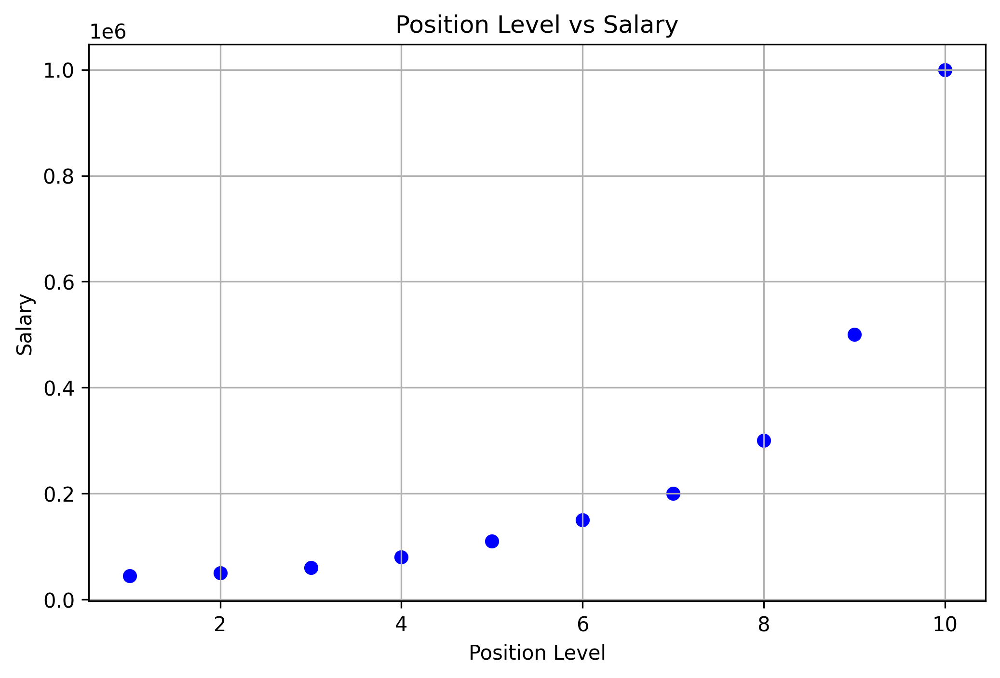
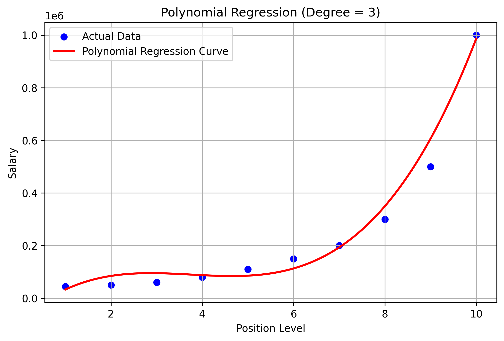

# Salary Prediction using Polynomial Regression

## Objective

The objective of this project is to predict employee salaries based on their position levels using Polynomial Regression.

---

## Dataset

- **Dataset:** Position Salaries Dataset
- **Source:** https://www.kaggle.com/datasets/akram24/position-salaries

---

## Libraries Used

- NumPy
- Pandas
- Matplotlib
- Scikit-learn

---

## Methodology

1. Imported the required libraries.
2. Loaded the dataset.
3. Performed data understanding and preprocessing.
4. Split the dataset into training and testing sets.
5. Applied Polynomial Features (Degree = 3).
6. Trained a Polynomial Regression model.
7. Predicted salaries for the test dataset.
8. Evaluated the model using MAE, MSE, and R² Score.
9. Visualized the results using scatter and regression plots.

---

## Results

The Polynomial Regression model accurately captured the non-linear relationship between position level and salary. The evaluation metrics demonstrated good prediction performance with a high R² score.

---

## Visualizations

### Original Data

### Polynomial Regression Curve

---

## Conclusion

Polynomial Regression performed better than Linear Regression for this dataset because it effectively models the non-linear relationship between position level and salary, resulting in more accurate predictions.